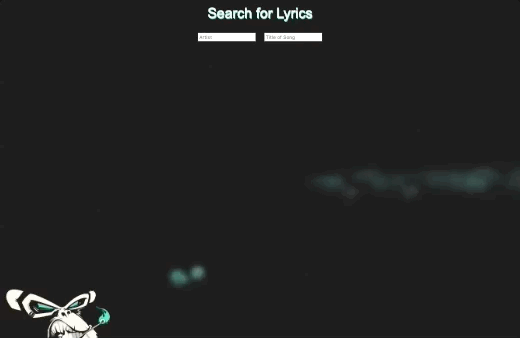

## Summary

In this assignment I was instructed to create a front end for an API of my choice. I chose an API to retrieve the lyrics of a song.

## Technologies Used

- Axios
- Javascript - https://www.javascript.com/
- REACT - https://reactjs.org/
- CSS
- HTML
